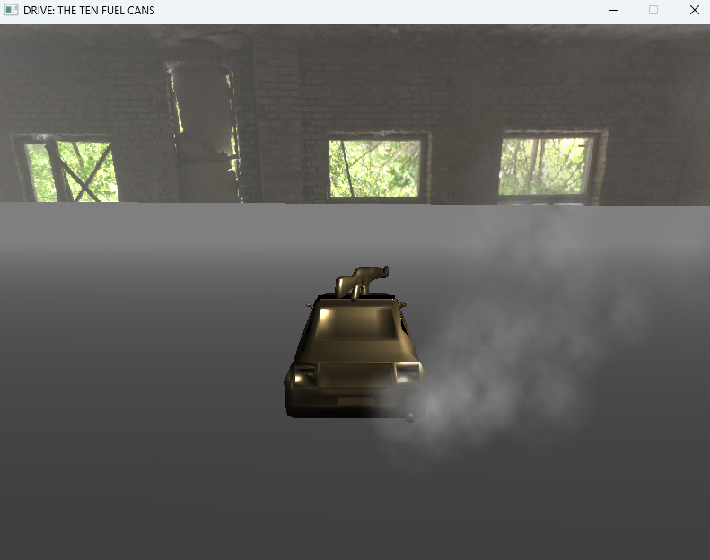
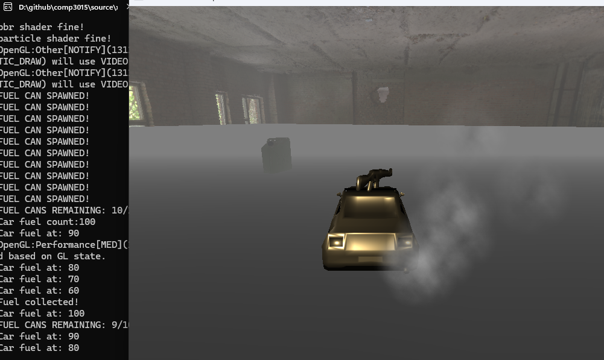

# COMP3015 CW2
## DRIVE: THE TEN FUEL CANS
You just woke up in your car, in a foggy abandoned building. Your car is running out of fuel and you need to find and collect all 10 fuel cans to survive.

## Youtube Link:

## User Manual
### To Launch the Game
-	Download the “Executable Version” folder.
-	Run the .exe file
### Game Objectives 
-	Collect fuel cans, every can that you collect tops up your fuel
-	Collect all 10 fuel cans to win before your fuel runs out
### Game Controls
-	Left Arrow - Turn left
-	Right Arrow - Turn right
-	Up Arrow - Drive forward
-	Down Arrow - Reverse
### Additional Information
You can import your own car model if it is a “.obj” file. (Note that if the size is incorrect, you will need to open 3D software such as Blender and import your object, tap A to select all and then S to scale and drag your mouse to make it bigger, import the car and repeat if the size is off. Or you can enjoy the low-poly mustang with the broken AK which doesnt shoot)
-	Navigate to the media folder and move the car.obj file into your desktop to save it incase your model does not work.
-	Import your own .obj file and name it "car.obj" exactly.

## Project Setup
I started with a template provided by the course which I turned into a toon shaded car inspector initially. This implemented lights, a spinning toon shaded car model, textures and a textured plane and skybox. It was pieced together from tutorials both from the OpenGL website and from the course tutorials. Below you can see the first implementation.

I then learned about more advanced features and created a scene which implements PBR, fog, multiple lights and particles. I then added some gameplay. 

## System Info
- I used Visual Studio 2022 to write and test the code locally.
- OS is Windows 11, I am using an Nvidia RTX 4070 graphics card with OpenGL version 4.6.

## Inspiration
My dissertation project is Gunman Drift, it is a drifting and shooting game. It has a mobile, VR, and a PC version. I thought it would be interesting to at least make a driving game in OpenGL. One of the taught features which stood out to me was fog. Heavy fog can commonly be found in horror games and a horror game that I grew up with was called “Slender: The Eight Pages”. The objective is to find all 8 pages hidden around a map while the monster “Slenderman” chases you. By this logic I added a fuel counter which runs out with time and as the player you must find all the fuel cans in the foggy map to win before you run out of fuel.

## What makes this project unique
The car model can be and is encouraged to be swapped out which means you could technically make any car or object the main character of this game.

## Possible Improvements
I would add audio, UI, different levels, and an enemy which scares the player if they lose to further aline with the horror theme and to make this a complete game.

## Assets
There are some assets which I took from the internet which are used in this project:
- https://free3d.com/3d-model/ferrari-formula-1-72527.html - F1 Car
- Provided in tutorials - Smoke Texture
- https://hdri-skies.com/ - Skybox

PBR - Used to add roughness, this makes the car look metallic and gold.

PBR Vertex Shader Image

PBR Fragment Shader Image

Particle - Used to create smoke particles for the car

Particle Vertex Shader Image

Particle Fragment Shader Image

TOON - toonSpotSingleColor 
Toon Vertex Shader Image
Toon Fragment Shader Image

Used for the fuel cans
SKYBOX - skyBox
SkyboxVertex Shader Image
Skybox Fragment Shader Image
FOG - Added to the skybox, fuel cans, and plane

